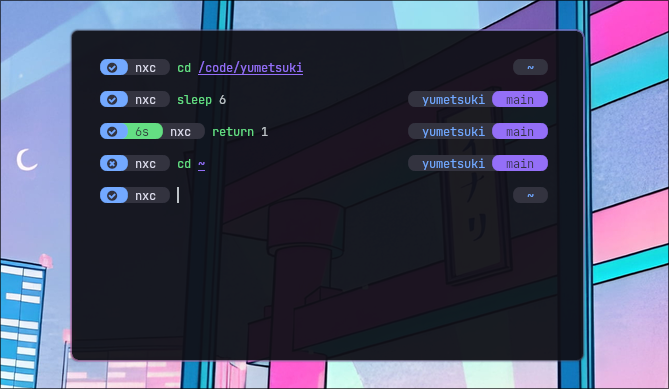

<p align=center>
    <br>
    fast, cute, <i>and-of-course, roundy</i> prompt theme for zsh
</p>

# 📺 Preview



> Preview with [cherry colorscheme](https://github.com/nullxception/cherry-kde/blob/main/kitty/cherry.conf) and [JetBrains Mono Nerd Font](https://github.com/ryanoasis/nerd-fonts/releases/latest)

# 🧪 Required

- [Nerd-patched](https://github.com/ryanoasis/nerd-fonts)'s Fonts
- Terminal with unicode support.

To check whether your terminal ready to using this theme, use this command :

```sh
echo -e '\ue0b6\ue0b4'
```

if it returns a circle, then we can go to the next step 🥳

# 🔌 Installation

- antigen

```zsh
antigen bundle nullxception/roundy
```

- zplug

```zsh
zplug nullxception/roundy, use:roundy.zsh, from:github, as:theme
```

- zinit

```zsh
zinit light nullxception/roundy
```

# 🛠 Prompt options

Options in roundy are configured in a regular variable, you can override it on your `.zshrc`.
Here's Default Options that currently available to override:

```sh
# Icon definition for Command's Exit Status
# Note: If your custom symbol overlaps the background or didn't have enough width,
#       you can add space at the end of your defined symbol.
ROUNDY_EXITSTATUS_GOOD="﫟"
# You can also using hex code like this
ROUNDY_EXITSTATUS_BAD=$'\uf658 '

# Minimal time (in ms) for the Time Execution of Command is displayed in prompt
# Set to 0 to disable it
ROUNDY_TEXC_MIN_MS=5

# Overriding username info
ROUNDY_USER_CONTENT_NORMAL=" %n "
ROUNDY_USER_CONTENT_ROOT=" %n "

# Working Directory Info Mode
# Valid choice are : "full", "short", or "dir-only"
# Example Output
#   full     : /etc/httpd/conf/extra
#   short    : /e/h/c/extra
#   dir-only : extra
ROUNDY_DIR_MODE="dir-only"

# Whether drawing a gap between a prompt
ROUNDY_PROMPT_HAS_GAP=true
```

## 🎨 Colors

By nature of Zsh, colors can be specified using :

- a decimal integer (0-15, or 0-255 if `$TERM` supported)
- alias of the eight colors provided by zsh
- or, as a regular #FFFFFF color hex (if `$TERM` supported, or with the help of `zsh/nearcolor` module)

```sh
# Command Exit Status
ROUNDY_COLORS_BG_EXITSTATUS=4
ROUNDY_COLORS_FG_EXITSTATUS=0

# Time Execution of Command
ROUNDY_COLORS_BG_TEXC=0
ROUNDY_COLORS_FG_TEXC=2

# User Display
ROUNDY_COLORS_BG_USER=8
ROUNDY_COLORS_FG_USER=7

# Directory Info
ROUNDY_COLORS_BG_DIR=8
ROUNDY_COLORS_FG_DIR=4

# Git Info
ROUNDY_COLORS_BG_GITINFO=5
ROUNDY_COLORS_FG_GITINFO=0
```

# 😇 Credits

- Inspired by [Harry Elric](https://github.com/owl4ce)'s [Joyful Desktop v3](https://github.com/owl4ce/dotfiles/tree/3.0) prompt
- [ryanoasis](https://github.com/ryanoasis)'s [Nerd Fonts](https://github.com/ryanoasis/nerd-fonts) for half-circle and most of the awesome additional glyphs on Nerd Fonts

# 📄 License

Copyright © 2020 [Nauval Rizky](https://github.com/nullxception). This project is [BSD 3-Clause License](LICENSE) licensed.
